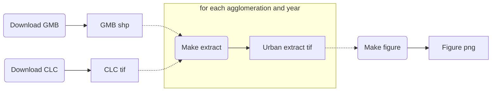

When I started using Jupyter Notebooks, about three years ago, I was astonished of how well that suited my iterative approach to both data analysis and software development. Nevertheless, probably like many others, I also embraced some toxic habits. 

For instance, after applying many complex transformation to a large pandas DataFrame, would often add a cell like that below:

```python
# cache the result
df.to_csv('df_after_complex_transformation.csv')
```

immediately followed by another cell such as:

```python
# resume from here
df = pd.read_csv('df_after_complex_transformation.csv')
```

so that when reopening the notebook, I could resume from that point, avoiding to apply the same computationally-expensive tarnsformations.

While practical at first, these kind of habits have obvious caveats, even when such notebooks are meant to be used by myself. First of all, it is hard to remeber such tricks when you reopen a notebook some weeks later. Second, and most importantly, the lax nature of Jupyter Notebooks can make it hard to determine the state of our environment, that is, we do not always know which cells have been executed and in which order[^i-dont-like-notebooks].

In any case, while the issues above can be settled through a good organization, documentation and source control of the code, I felt that there was something missing in my coding toolbox. More precisely, I felt that for data-centric tasks, source control of the code was not enough. Imagine that I found out that I made a mistake in my complex transformation of the DataFrame above and fixed the code accordingly. Since data files like `df_after_complex_transformation.csv` are kept outside source control, when reopening the notebook after some days, perhaps even in another computer, it might be hard to know whether such interim data files are the ones that result from the older code with mistakes or, on the contrary, they are up to date with the fix.

It was not until some months ago, tired of sticking to toxic habits, that I started digging deep into blog posts and GitHub repositories in order to find a solution to this. The best solution came in the form of "A logical, reasonably standardized, but flexible project structure for doing and sharing data science work", namely [Cookiecutter Data Science](http://drivendata.github.io/cookiecutter-data-science/).

As the reader may already know, there exist several tools devoted to manage such kind of computational workflows. TODO


## An example from geospatial data science: analysis of the spatiotemporal patterns of urbanization

I will illustrate the question through an example. I am currently working on a paper in which I intend to evaluate the spatiotemporal patterns of land cover change associated to urbanization in the main Swiss urban agglomerations. In order to do so, for each of the urban agglomerations I need to generate a time series of raster representations of the land cover. Two datasets are used for this purpose: 

* The [Corine Land Cover (CLC)](https://land.copernicus.eu/pan-european/corine-land-cover) datasets for the years 2000, 2006 and 2012. Each dataset cosists of a single `.tif` raster file for the whole European extent that features its land cover, categorized into 44 land cover classes.
* The Swiss [Generalized Municipal Boundaries (GMB)](https://www.bfs.admin.ch/bfs/de/home/dienstleistungen/geostat/geodaten-bundesstatistik/administrative-grenzen/generalisierte-gemeindegrenzen.assetdetail.5247306.html), which consist of a `.shp` vector shape file featuring the administrative boundaries of the municipalities that configure the main Swiss urban agglomerations.

The preprocessing of the data is as follows. For a given agglomeration, at a given year, we first clip the CLC raster of the corresponding year to the extent of the vector boundaries of the agglomeration in question. Since we only interested in the land cover change associated to urbanization, we will then reclassify the pixels of the clipped raster from the 44 land cover classes of CLC to a simplified urban/non-urban representation. The task is illustrated in the animation below.

 

We will then use the [PyLandStats library](https://github.com/martibosch/pylandstats) in order to compute two landscape metrics: the [proportion of landscape](http://www.umass.edu/landeco/research/fragstats/documents/Metrics/Area - Density - Edge Metrics/Metrics/C4 - PLAND.htm) occupied by urban land cover, and the [area-weighted fractal dimension](http://www.umass.edu/landeco/research/fragstats/documents/Metrics/Shape Metrics/Metrics/P9 - FRAC.htm) of urban patches, which reflects the complexity of their shape.
Finally, we will assemble the computed values for each agglomeration and year in order to generate the following figure, which will help to assess whether the land use change associated to urbanization is leading towards a landscape with more complex shapes.

 


### Enter the computational workflow approach

Let us apply the [Cookiecutter Data Science](http://drivendata.github.io/cookiecutter-data-science/) project structure and its principles to our example case. A repository following such structure, with all the materials needed to reproduce our analysis is available at [GitHub](https://github.com/martibosch/swiss-urbanization-post). Following the [analysis as a Directed Acyclic Graph (DAG)](http://drivendata.github.io/cookiecutter-data-science/#analysis-is-a-dag) approach, a simplified version of the workflow for the task above can be represented as follows:



The nodes with rounded corners represent tasks, whereas the ones with sharp corners represent data states (for instance, interim files). The dashed links towards the highighted part denote that there should not be a single *Make extract* and *Urban extract* pair of nodes but a pair for each urban agglomeration and for each year. Since we consider the 3 largest Swiss urban agglomerations (Zurich, Geneva and Basel) for the four years 2000, 2006 and 2012, we will generate a total of 9 urban extracts, which will then be all used in order to produce the final figure.

Note that the computation of the two landscape metrics is done within the *Make figure* task. Had it been a computationally-expensive task or had the computed metrics been required for any further step in our analysis, it might have been reasonable to add a dedicated step in the DAG, e.g., a *Compute metrics* task between *Urban extract* and *Make figure*, perhaps dumping the computed metrics to an interim *csv* file.

#### Step 1: Download the raw datasets

The [data immutability](http://drivendata.github.io/cookiecutter-data-science/#data-is-immutable) principle basically states that data should never be edited manually, and that anyone should be able to fully reproduce our analysis using only the raw datasets and our code. Accordingly, the *download* step downloads the raw datasets to a `data/raw` directory of our repository (whose files will be ignored by git). While some datasets can be downloaded by anyone from open-data services like [Zenodo](https://zenodo.org/), other datasets like CLC require a registration. In the latter case, I store the raw datasets in a personal S3 bucket, and create a Python script that downloads the files from the bucket using the [boto3](https://github.com/boto/boto3) library. Overall, such approach to the *download* step ensures that the raw datasets will be the same regardless on whether I am running the analysis in my laptop or my office's desktop computer.

The source of the script to download the raw GMB and CLC datasets for this case can be found [in the GitHub repo](https://github.com/martibosch/swiss-urbanization-post/blob/master/swiss_urbanization/data/download_data.py). Note that 

#### Step 2: Make the urban extracts

The *make extract*

* Make:
    * We could write good-looking Makefiles, however, we would not be making the most of what make has to offer, especially the automatic detection of when a target has to be run (or not)
    * Best practices:
        * Maximum task granularity: if possible, one input, one output
        * Manage input and output filepaths and directories from Makefile.
    * For some analysis cases, it is hard to stick to the above principles (many tasks are bettern implemented with multiple inputs/outputs). Example: ideally Python scripts should be agnostic to the way we have stored the urban extracts, but the plotting methods needs to associate files with multiple cities and years.
    * Pros: super flexible (in its way)
    * Cons: Makefiles can get super nasty

## Notes

[^i-dont-like-notebooks]: See [a talk by Joel Grus at JupyterCon 2018](https://www.youtube.com/watch?v=7jiPeIFXb6U) about Jupyter Notebooks, toxic habits and reasoning about the state of the environment.
