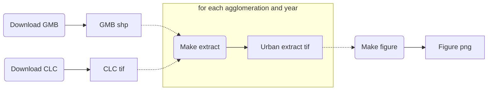

When I started using Jupyter Notebooks, about three years ago, I was astonished of how well that suited my iterative approach to both data analysis and software development. Nevertheless, probably like many others, I also embraced some toxic habits. 

For instance, after applying many complex transformation to a large pandas DataFrame, would often add a cell like that below:

```python
# cache the result
df.to_csv('df_after_complex_transformation.csv')
```

immediately followed by another cell such as:

```python
# resume from here
df = pd.read_csv('df_after_complex_transformation.csv')
```

so that when reopening the notebook, I could resume from that point, avoiding to apply the same computationally-expensive tarnsformations.

While practical at first, these kind of habits have obvious caveats, even when such notebooks are meant to be used by myself. First of all, it is hard to remeber such tricks when you reopen a notebook some weeks later. Second, and most importantly, the lax nature of Jupyter Notebooks can make it hard to determine the state of our environment, that is, we do not always know which cells have been executed and in which order[^i-dont-like-notebooks].

In any case, while the issues above can be settled through a good organization, documentation and source control of the code, I felt that there was something missing in my coding toolbox. More precisely, I felt that for data-centric tasks, source control of the code was not enough. Imagine that I found out that I made a mistake in my complex transformation of the DataFrame above and fixed the code accordingly. Since data files like `df_after_complex_transformation.csv` are kept outside source control, when reopening the notebook after some days, perhaps even in another computer, it might be hard to know whether such interim data files are the ones that result from the older code with mistakes or, on the contrary, they are up to date with the fix.

It was not until some months ago, tired of sticking to toxic habits, that I started digging deep into blog posts and GitHub repositories in order to find a solution to this. The best solution came in the form of "A logical, reasonably standardized, but flexible project structure for doing and sharing data science work", namely [Cookiecutter Data Science](http://drivendata.github.io/cookiecutter-data-science/).

As the reader may already know, there exist several tools devoted to manage such kind of computational workflows, and in fact, my initial idea was to write a post in which the appropriateness of such existing tools to geospatial data science was discussed. TODO: Machine learning centric


## An example from geospatial data science: analysis of the spatiotemporal patterns of urbanization

I will illustrate the question through an example. I am currently working on a paper in which I intend to evaluate the spatiotemporal patterns of land cover change associated to urbanization in the main Swiss urban agglomerations. In order to do so, for each of the urban agglomerations I need to generate a time series of raster representations of the land cover. Two datasets are used for this purpose: 

* The [Corine Land Cover (CLC)](https://land.copernicus.eu/pan-european/corine-land-cover) datasets for the years 2000, 2006 and 2012. Each dataset cosists of a single `.tif` raster file for the whole European extent that features its land cover, categorized into 44 land cover classes.
* The Swiss [Generalized Municipal Boundaries (GMB)](https://www.bfs.admin.ch/bfs/de/home/dienstleistungen/geostat/geodaten-bundesstatistik/administrative-grenzen/generalisierte-gemeindegrenzen.assetdetail.5247306.html), which consist of a `.shp` vector shape file featuring the administrative boundaries of the municipalities that configure the main Swiss urban agglomerations.

The preprocessing of the data is as follows. For a given agglomeration, at a given year, we first clip the CLC raster of the corresponding year to the extent of the vector boundaries of the agglomeration in question. Since we only interested in the land cover change associated to urbanization, we will then reclassify the pixels of the clipped raster from the 44 land cover classes of CLC to a simplified urban/non-urban representation. The task is illustrated in the animation below.

 

We will then compute two landscape metrics: the [proportion of landscape](http://www.umass.edu/landeco/research/fragstats/documents/Metrics/Area - Density - Edge Metrics/Metrics/C4 - PLAND.htm) occupied by urban land cover, and the [area-weighted mean fractal dimension](http://www.umass.edu/landeco/research/fragstats/documents/Metrics/Shape Metrics/Metrics/P9 - FRAC.htm) of urban patches, which reflects the complexity of their shape.
Finally, we will assemble the computed values for each agglomeration and year in order to generate the following figure, which will help to assess whether the land use change associated to urbanization is leading towards a landscape with more complex shapes.

 


## Enter the computational workflow approach

Let us apply the [Cookiecutter Data Science](http://drivendata.github.io/cookiecutter-data-science/) project structure and its principles to our example case. A repository following such structure, with all the materials needed to reproduce our analysis is available at [GitHub](https://github.com/martibosch/swiss-urbanization-post). Following the [analysis as a Directed Acyclic Graph (DAG)](http://drivendata.github.io/cookiecutter-data-science/#analysis-is-a-dag) approach, a simplified version of the workflow for the task above can be represented as follows:



The nodes with rounded corners represent tasks, whereas the ones with sharp corners represent data states (for instance, interim files). The dashed links towards the highighted part denote that there should not be a single *make extract* and *urban extract* pair of nodes but a pair for each urban agglomeration and for each year. Since we consider the 3 largest Swiss urban agglomerations (Zurich, Geneva and Basel) for the four years 2000, 2006 and 2012, we will generate a total of 9 urban extracts, which will then be all used in order to produce the final figure.

Note that the computation of the two landscape metrics is done within the *make figure* task. Had it been a computationally-expensive task or had the computed metrics been required for any further step in our analysis, it might have been reasonable to add a dedicated step in the DAG, e.g., a *compute metrics* task between *urban extract* and *make figure*, perhaps dumping the computed metrics to an interim *csv* file.

### Step 1: Download the raw datasets

The [data immutability](http://drivendata.github.io/cookiecutter-data-science/#data-is-immutable) principle basically states that data should never be edited manually, and that anyone should be able to fully reproduce our analysis using only the raw datasets and our code. Accordingly, the *download* steps download the raw datasets to a `data/raw` directory of our repository (whose files will be ignored by git). 
While some datasets can be downloaded by anyone from open-data services like [Zenodo](https://zenodo.org/), other datasets like CLC require a registration. In the latter case, I store the raw datasets in a personal S3 bucket, and then create a Python script that downloads the files from the bucket using the [boto3](https://github.com/boto/boto3) library. 
Overall, such approach to the *download* steps ensure that the raw datasets will be the same regardless on whether I am running the analysis in my laptop or my office's desktop computer.


### Step 2: Make the urban extracts

The *make extract* step perform the preprocessing task described above, taking datasets from `data/raw` as inputs and outputting the urban exracts raster files to `data/processed`. 


### Step 3: Make the figure

Finally, the *make figure* will first use the [PyLandStats library](https://github.com/martibosch/pylandstats) in order to compute the landscape metrics for the urban extract located at `data/processed`, plot their evolution for each agglomeration, and then save the figure to `reports/figures`. 


## Automating the worfklow with GNU Make

As noted above, we intend to automate the reasoning about the state part of our analysis, that is, moving through the steps of our workflow. Knowing if we have already applied such transformation bla bla bla
Ideally, we want manage the execution of such steps explicitly (without hidden state) and in an automated manner, avoiding tricks such as caching an interim `df_after_complex_transformation.csv` file.

To that end, we will use GNU Make.  Many people (like myself) always thought of Make as a tool to compile executables from source code, especially in C. Their syntax is quite simple. We create a filed named `Makefile` at the root of our repository, and write a set of rules there.

```make
target: prerequisites
    commands
```

The way in which we can chain rules can be used to mimic our analysis DAG. A very straightforward way to do so would be with a `Makefile` such as:

```make
download_gmb:
    python src/data/download_gmb.py

download_clc:
    python src/data/download_clc.py
    
extracts: download_gmb download_clc
    python src/data/make_extracts.py
    
figure: make_extracts
    python src/visualization/make_figure.py
```

Then, from the repository's root, we can run `make figure`, and Make will detect that the `figure` target depends on the `extracts` target, and that the latter depends on both `download_gmb` and `download_clc`, and therefore Make will automatically determine the right order in which the tasks must be executed in order to produce our figure. This is the idea beyond the concept of an "automated management of the computational workflow". 
Nevertheless, as elegant as the above `Makefile` might look, and despite the fact that it would succeed in producing our figure, we would be making a poor use of the features that Make has to offer. 


### Detecting completed targets

Imagine that our `src/visualization/make_figure.py` has a mistake which is (for example) labeling our figure's axes incorrectly. If we fix such mistake, and run `make figure` again, Make will blindly execute again all of the necessary steps, including the download of 551.9 MB of unchanged raw datasets, and the generation of the exact same 9 urban extracts. Since our datasets could be of gigabytes, and our steps could be computationally expensive algorithms, we want our management of the computational workflow to automatically detect whether a task must be re-executed or not.

This idea is in fact central to Make. In order to explot it, we just need that targets match file paths. For instance, we could refactor our download scripts to take the destination file path as command-line argument and download the files to such location. Under these circumstances, we could use such destination file path as target of the two download rules and prerequisite of the `extracts` rule, as in:

```make
data/raw/gmb/gd-b-00.03-875-gg18.zip:
    python src/data/download_gmb.py data/raw/gmb/gd-b-00.03-875-gg18.zip
```

or we could further DRY our rule by storing such path in a variable of our `Makefile` as in:

```make
GMB_ZIP_FILEPATH = data/raw/gmb/gd-b-00.03-875-gg18.zip

$(GMB_ZIP_FILEPATH):
    python src/data/download_gmb.py $(GMB_ZIP_FILEPATH)
```

and such variable could also replace `download_gmb` as a prerequisite of the `extracts` rule, as in:

```make
GMB_ZIP_FILEPATH = data/raw/gmb/gd-b-00.03-875-gg18.zip

$(GMB_ZIP_FILEPATH):
    python src/data/download_gmb.py $(GMB_ZIP_FILEPATH)
    
. . .

# we will deal with `download_clc` later
extracts: $(GMB_ZIP_FILEPATH) download_clc
    python src/data/make_extracts.py
```

Now (let's ignore the `download_clc` rule for a moment), whenever we re-run `make figure`, Make will automatically detect that `data/raw/gmb/gd-b-00.03-875-gg18.zip` and that there is no need to download it (that is, running `src/data/download_gmb.py`) again. 

#### Two comments on Phony targets

Note, however, that if we now want download the GMB dataset, the elegant command `make download_gmb` becomes the less appealing `make data/raw/gmb/gd-b-00.03-875-gg18.zip`. We might overcome this drawback by writing an additional dummy rule such as:

```make
. . .

download_gmb: $(GMB_SHP_FILEPATH)
```

In Make, targets which do not correspond to any file path, such as `download_gmb`, are called [Phony targets](https://www.gnu.org/software/make/manual/html_node/Phony-Targets.html). A typical example would be a rule which does not produce any output, for instance, [a rule to delete compiled Python files](https://github.com/martibosch/swiss-urbanization-post/blob/master/Makefile#L94). Two remarks are especially relevant in this situation:

* When a rule depends on a Phony target, Make will always execute the rule associated with the Phony target. This is in sharp contraposition to file path targets, which Make will ignore if the corresponding file is up to date. That means that dummy rules such as the proposed `download_gmb` cannot be used as rule prerequisites. That is, using

    ```make
    # again, let us ignore `download_clc` for now
    extracts: download_gmb download_clc
        python src/data/make_extracts.py
    ```
    
    instead of `extracts: $(GMB_ZIP_FILEPATH) download_clc`, implies that Make will no longer be able to detect whether downloading the GMB dataset is necessary or not. The bottom line is: you might add dummy rules with Phony targets to have a more elegant command-line interface with your Makefile, but do not use such dummy rules as prerequisites of other rules unless you really want them to be executed regardless on the state of your workflow.
    
* Was there a file matching the path `download_gmb`, Make would assume that the target refers to such file. In order to avoid such conflicts, Phony targets can be explicitly declared as prerequisites of a rule with the [special target](https://www.gnu.org/software/make/manual/html_node/Special-Targets.html#Special-Targets) `.PHONY` as in:

    ```make
    .PHONY: download_gmb
    
    . . .
    ```

#### File modification times and order-only prerequisites

Some rules might require creating directories in our tree. For instance, the `data/raw/gmb` directory in which `gd-b-00.03-875-gg18.zip` is to be downloaded might not exist. There are many ways of dealing with such situation, for instance, within the Python script. Nonetheless, *handling this explicitly within the Makefile might be preferable, in order to avoid potential sources of hidden state*. We might thus add an additional rule that creates the `data/raw/gmb` directory only when such path does not exist (otherwise it would throw a `File exists` error). We can do so as follows:

```make
GMB_DIR = data/raw/gmb
# Since `$(GMB_DIR)` is constant, we use `:=` so that Make expands the path 
# only once instead of doing so every time `GMB_ZIP_FILEPATH` is used. 
# See https://www.gnu.org/software/make/manual/make.html#Flavors
GMB_ZIP_FILEPATH := $(GMB_DIR)/gd-b-00.03-875-gg18.zip

$(GMB_DIR):
    mkdir $(GMB_DIR)

$(GMB_ZIP_FILEPATH): $(GMB_DIR)
    python src/data/download_gmb.py $(GMB_ZIP_FILEPATH)
```

Let us go further. Since our tasks will require the use of the GMB shapefiles rather than of the GMB zip, we might use the `unzip` command in order to extract them. We can even remove the GMB zip once the shapefiles are extracted. This could all be done as in:

```make
GMB_DIR = data/raw/gmb
GMB_ZIP_FILEPATH := $(GMB_DIR)/gd-b-00.03-875-gg18.zip
GMB_SHP_FILEPATH := $(GMB_DIR)/g1a18.shp

$(GMB_DIR):
    mkdir $(GMB_DIR)

$(GMB_SHP_FILEPATH): $(GMB_DIR)
    python src/data/download_gmb.py $(GMB_ZIP_FILEPATH)
    unzip $(GMB_ZIP_FILEPATH) -d $(GMB_DIR)
    rm $(GMB_ZIP_FILEPATH)
```

A peculiar issue can arise with the above Makefile. When using `unzip` command, the modification times of the extracted files (such as `$(GMB_SHP_FILEPATH)`) will be those of their creation, whereas for `$(GMB_DIR)`, the modification time will correspond to the moment in which the files were extracted under such directory. Accordingly, in the eyes of Make, the target `$(GMB_SHP_FILEPATH)` will appear older than its prerequisite `$(GMB_DIR)`, and therefore the rule will always be executed. 

There are two ways to work around such issue. On the one hand, we could use the `touch` command, which will set the modification date of `$(GMB_SHP_FILEPATH)$` to the current date[^unzip-touch], as in:

```make
. . .

$(GMB_SHP_FILEPATH): $(GMB_DIR)
    python src/data/download_gmb.py $(GMB_ZIP_FILEPATH)
    unzip $(GMB_ZIP_FILEPATH) -d $(GMB_DIR)
    touch $(GMB_SHP_FILEPATH)
    rm $(GMB_ZIP_FILEPATH)
```

Alternatively, we could also tell Make that `$(GMB_DIR)` is an [order-only prerequisites](https://www.gnu.org/software/make/manual/html_node/Prerequisite-Types.html), which ignore the modification dates and are executed only if the files or directories in question do not exist. Order-only prerequisites must be placed to the right of a pipe symbol `|`, which in our example would be:

```make
. . .

# a target might have both normal and order-only prerequisites, e.g.,
# $(GMB_SHP_FILEPATH): some-normal-prerequisite-target | $(GMB_DIR)
$(GMB_SHP_FILEPATH): | $(GMB_DIR)
    python src/data/download_gmb.py $(GMB_ZIP_FILEPATH)
    unzip -j $(GMB_ZIP_FILEPATH) -d $(GMB_DIR)
    rm $(GMB_ZIP_FILEPATH)
```

Again, note that we could use [Python's zipfile library](https://docs.python.org/3/library/zipfile.html) and deal with the extraction of the shapefiles within the script `src/data/download_gmb.py`, nevertheless this will further complicate the non-trivial task of ensuring that Make manages our computational workflow correctly.

### Detecting edited source files

### Pattern rules and abstracting our workflow from the data

Let us now consider the task of downloading the CLC datasets. Like GMB, CLC datasets come as a zip file, from which we intend to extract a geotiff file (instead of shapefiles in GMB). The major difference with respect to GMB is that we now need to download three datasets, namely one for each year. Accordingly, `src/data/download_clc.py` needs to know which CLC dataset to download in every case. Since CLC names its datasets as in `g100_clc00_V18_5`, `g100_clc06_V18_5` and `g100_clc12_V18_5` (note the year codes `00`, `06` and `12` right after the `clc` characters), let `src/data/download_clc.py` take such basename as first argument (to know which dataset to download), and as usual, the destination file path as second argument. Consider the following snippet:

```make
# Note that we should first handle the creation of the `data/raw/clc` directory 
# like explained above for `$(GMB_DIR)`
CLC_DIR = data/raw/clc

$(CLC_DIR):
	mkdir $(CLC_DIR)
    
# and now we can start with the CLC dataset for the year code 00 (2000)
CLC_00_BASENAME = g100_clc00_V18_5
CLC_00_ZIP_FILEPATH := data/raw/clc/$(CLC_00_BASENAME).zip

$(CLC_00_ZIP_FILEPATH): | $(CLC_DIR)
    python src/data/download_clc.py $(CLC_00_BASENAME) \
        $(CLC_00_ZIP_FILEPATH)
```

Since writing the foregoing rule for each dataset year would clearly be over-repetitive and become hard to mantain, Make features [pattern rules](https://www.gnu.org/software/make/manual/html_node/Pattern-Rules.html), which are like ordinary rules but use a pattern-matching mechanism on file paths. We can tell make that the commands to any zip target within `$(CLC_DIR)` are as follows:

```make
. . .

$(CLC_DIR)/%.zip: | $(CLC_DIR)
	python src/data/download_clc.py $(notdir $@) $@
```

where the `%` is used to compose the target pattern. We could also tell Make, for examnple, to only match zip files starting by `g100_clc` as in `$(CLC_DIR)/g100_clc%.zip`. On the other hand, the full expanded path of the target (in the above example, that is `data/raw/clc/g100_clc00_V18_5.zip`) will be stored under the `$@` [automatic variable](https://www.gnu.org/software/make/manual/html_node/Automatic-Variables.html#Automatic-Variables), which we can use within the rule commands. Given how we have assumed `src/data/download_clc.py` to work, we can use [Make's functions for file names](https://www.gnu.org/software/make/manual/html_node/File-Name-Functions.html) `notdir` to extract the file name from the path (that is, `g100_clc00_V18_5.zip` from `data/raw/clc/g100_clc00_V18_5.zip`), and then `basename` to trim out the `.zip` extension.

In order to define an abstract computational workflow that is independent of the individual files[^abstract-workflow], we can define the datasets to be processed in a separate variable, as in the snippet below:

```make
. . .

CLC_BASENAMES = g100_clc00_V18_5 g100_clc06_V18_5 g100_clc12_V18_5

CLC_ZIP_FILEPATHS := $(addsuffix .zip $(addprefix $(CLC_DIR)/, $(CLC_BASENAMES)))

$(CLC_DIR)/%.zip: | $(CLC_DIR)
	python src/data/download_clc.py $(notdir $@) $@

download_clc: $(CLC_ZIP_FILEPATHS)
```

Were we to consider an additional dataset in our analysis, only by adding it to `CLC_BASENAMES`, Make would be able to manage and execute our computational workflow accordingly. With the file name functions `addprefix` and `addsuffix`, `CLC_ZIP_FILEPATHS` will be a list of file paths (such as `data/raw/clc/g100_clc00_V18_5.zip`) for each base name in `CLC_BASENAMES`. Whenever we exectue the Phony target `download_clc`, for each file path of `CLC_ZIP_FILEPATHS` [Make will detect that it matches the `$(CLC_DIR)/%.zip` pattern](https://www.gnu.org/software/make/manual/html_node/Pattern-Match.html#Pattern-Match) and proceed accordingly. Furthermore, since the next steps within the computational workflow do not require the zip files but the shapefiles and geotiff files that contain, we could [chain the pattern rules](https://www.gnu.org/software/make/manual/html_node/Chained-Rules.html) as in:

```make
. . .

CLC_BASENAMES = g100_clc00_V18_5 g100_clc06_V18_5 g100_clc12_V18_5

CLC_TIF_FILEPATHS := $(addsufix .tif $(addprefix $(CLC_DIR)/, $(CLC_TIF_FILENAMES)))

$(CLC_DIR)/%.zip: | $(CLC_DIR)
	python src/data/download_clc.py $(notdir $@) $@

$(CLC_DIR)/%.tif: $(CLC_DIR)/%.zip
	unzip $< $(notdir $@) -d $(CLC_DIR)
    touch $@

clc: $(CLC_TIF_FILEPATHS)
```

so that when executing `make clc`, Make first matches the `$(CLC_DIR)/%.tif`, and determines that such geotiff target requires its corresponding zip, which will in turn be matched by the above rule with the `$(CLC_DIR)/%.zip` target. Note that the `$<` right after `unzip` is another automatic variable of Make, which corresponds to the first prerequisite of the rule in question (in this case, the path to zip file). Under these circumstances, if there is no further reference to `$(CLC_DIR)/%.zip`, [Make will consider the zip files as intermediate](https://www.gnu.org/software/make/manual/html_node/Chained-Rules.html) and will therefore remove them once the `$(CLC_DIR)/%.tif` targets have been produced. The same will not happen after extracting `$(GMB_SHP_FILEPATH)` from `$(GMB_ZIP_FILEPATH)` since the path to the zip file is stored in the latter variable and in such case Make does not remove it. Nonetheless, we could achieve the same behavior for the GMB targets as follows:

```
. . .

$(GMB_DIR)/%.zip: | $(GMB_DIR)
	python src/data/download_gmb.py $@
$(GMB_DIR)/%.shp: $(GMB_DIR)/%.zip
    unzip $< -d $(notdir $@) $(GMB_DIR)
	touch $(GMB_SHP_FILEPATH)
    
gmb: $(GMB_SHP_FILEPATH)
```

As a final note, recall that we shall not use the `clc` target as prerequisite of subsequent rules, since in such case, Phony targets are always executed even if the required files are up to date. To that end, the prerequisite shall be `$(CLC_TIF_FILEPATHS)`.

For instance, with a `src/data/download_clc.py` script that takes as argument the 

The three CLC datasets that we use in this example are named `g100_clc00_V18_5`, `g100_clc06_V18_5` and `g100_clc12_V18_5`.

For instance, assuming that I had downloaded the three CLC files (that is, `g100_clc00_V18_5.tif`, `g100_clc06_V18_5.tif` and `g100_clc12_V18_5.tif`) to the `data/raw/clc` directory, and assuming that the script `src/data/make_extract.py` takes a first argument with the path to the input CLC raster, a second argument with the path to the input boundaries shapefile (which is the same for all the CLC files), and a third argument with the file path to dump the output, then I could define a rule as in:

```make
. . .

CLC_DIR = data/raw/clc
URBAN_EXTRACTS_DIR = data/processed

# This is the pattern rule. Note that $(GMB_SHP_FILEPATH) does not change
$(URBAN_EXTRACTS_DIR)/%.tif: $(CLC_DIR)/%.tif $(GMB_SHP_FILEPATH)
    python src/data/make_extract.py $(CLC_DIR)/$@.tif $(GMB_SHP_FILEPATH) \
        $(URBAN_EXTRACTS_DIR)/$@.tif
```

which will basically match the three `.tif` files at `$(CLC_DIR)`, and capture the matched pattern (that is, `g100_clc00_V18_5`, `g100_clc06_V18_5` and `g100_clc12_V18_5` respectively) under the `$@` [automatic variable](https://www.gnu.org/software/make/manual/html_node/Automatic-Variables.html#Automatic-Variables), and output each one of them to `$(URBAN_EXTRACTS_DIR)`. In short, it is equivalent to manually writing a rule such as:

```make
. . .

$(URBAN_EXTRACTS_DIR)/g100_clc00_V18_5.tif: $(CLC_DIR)/g100_clc00_V18_5.tif \
    $(BOUNDARIES_FILEPATH)
    python src/data/make_extract.py $(CLC_DIR)/g100_clc00_V18_5.tif \
        $(BOUNDARIES_FILEPATH) $(URBAN_EXTRACTS_DIR)/g100_clc00_V18_5.tif
```

for each of the three dataset files. Of course, in other cases we might have dozens of files, so mastering pattern rules becomes crucial. 


For the sake of introducing the pattern rules, we have assumed that the three CLC files had already been downloaded to the `data/raw/clc`.


## Concluding remarks

* Make:
    * We could write good-looking Makefiles, however, we would not be making the most of what make has to offer, especially the automatic detection of when a target has to be run (or not)
    * Best practices:
        * Maximum task granularity: if possible, one input, one output
        * Manage input and output filepaths and directories from Makefile.
    * For some analysis cases, it is hard to stick to the above principles (many tasks are bettern implemented with multiple inputs/outputs). Example: ideally Python scripts should be agnostic to the way we have stored the urban extracts, but the plotting methods needs to associate files with multiple cities and years.
    * Pros: super flexible (in its way)
    * Cons: Makefiles can get super nasty

#### Detecting edit source files: single download_data.py vs download_gmb.py+download_clc.py

#### Avoid hidden state: let Make (not Python) carry the burden of managing your workflow

While many (like myself) would feel more comfortable tackling the organization of a computational workflow in Python, it is important to delegate such burden to the Makefile. 
So far we have assumed that our download scripts, such as `src/data/download_gmb.py`, take the destination file path as a command-line argument. Nevertheless, our
Furthermore, we could event implement the management of the dataset directories within the Python scripts. Nevertheless, such interface would be hard to integrate within the Makefile. 

In order to make the most out of Make, it is preferable that the Python scripts are as agnostic of the project structure as possible. Ideally, all scripts should perform a one-input one-output task, so that Make rules can be of the form:

```make
. . .

$(OUTPUT_FILEPATH): $(INPUT_FILEPATH)
    python path/to/a/script.py $(INPUT_FILEPATH) $(OUTPUT_FILEPATH)
```

There might be some situations in geospatial data science in which batch processing of multiple files within the execution of the Python scripts avoids overhead costs. For example, `src/data/make_extract.py` is reading the same dataset . 

#

For instance, assuming that I had downloaded the three CLC files (that is, `g100_clc00_V18_5.tif`, `g100_clc06_V18_5.tif` and `g100_clc12_V18_5.tif`) to the `data/raw/clc` directory, and assuming that the script `src/data/make_extract.py` takes a first argument with the path to the input CLC raster, a second argument with the path to the input boundaries shapefile (which is the same for all the CLC files), and a third argument with the file path to dump the output, then I could define a rule as in:

```make
. . .

CLC_DIR = data/raw/clc
URBAN_EXTRACTS_DIR = data/processed

# This is the pattern rule. Note that $(GMB_SHP_FILEPATH) does not change
$(URBAN_EXTRACTS_DIR)/%.tif: $(CLC_DIR)/%.tif $(GMB_SHP_FILEPATH)
    python src/data/make_extract.py $(CLC_DIR)/$@.tif $(GMB_SHP_FILEPATH) \
        $(URBAN_EXTRACTS_DIR)/$@.tif
```

which will basically match the three `.tif` files at `$(CLC_DIR)`, and capture the matched pattern (that is, `g100_clc00_V18_5`, `g100_clc06_V18_5` and `g100_clc12_V18_5` respectively) under the `$@` [automatic variable](https://www.gnu.org/software/make/manual/html_node/Automatic-Variables.html#Automatic-Variables), and output each one of them to `$(URBAN_EXTRACTS_DIR)`. In short, it is equivalent to manually writing a rule such as:

```make
. . .

$(URBAN_EXTRACTS_DIR)/g100_clc00_V18_5.tif: $(CLC_DIR)/g100_clc00_V18_5.tif \
    $(BOUNDARIES_FILEPATH)
    python src/data/make_extract.py $(CLC_DIR)/g100_clc00_V18_5.tif \
        $(BOUNDARIES_FILEPATH) $(URBAN_EXTRACTS_DIR)/g100_clc00_V18_5.tif
```

for each of the three dataset files. Of course, in other cases we might have dozens of files, so mastering pattern rules becomes crucial. 


For the sake of introducing the pattern rules, we have assumed that the three CLC files had already been downloaded to the `data/raw/clc`. However, note that, unlike `src/data/download_gmb.py`, `src/data/download_clc.py` needs to download three files (one for each year). To accomplish that, we could specify the three files to be downloaded within the `src/data/download_clc.py` in a way that the script takes the destination folder (that is, `data/raw/clc`) as argument and dumps the three files there.

Afterwards, we could perfectly 


As mentioned above, while we could specify the three files to be downloaded within `src/data/download_clc.py`, it is better to let Make handle that. After all, if we want Make to be able to assess whether the CLC datasets have already been downloaded or not, Make needs to know the local paths where they are to be stored.

In order to make the most out of Make, it is preferable that the Python scripts are as agnostic of the project structure as possible. Ideally, all scripts should perform a one-input one-output task, so that Make rules can be of the form

For the sake of writing nice Make rules, we have assumed that the script `src/data/make_extract.py` takes only the input and output file paths as arguments. However, this is completely unrealistic since we need to make an extract not only for each year (which could be handled through pattern rules), but also for each agglomeration.

```make
CLC_DIR = data/raw/clc
URBAN_EXTRACTS_DIR = data/processed
AGGLOMERATION_SLUGS = basel geneve zurich


```

```make


CLC_FILEPATHS = 

```


## Notes

[^i-dont-like-notebooks]: See [a talk by Joel Grus at JupyterCon 2018](https://www.youtube.com/watch?v=7jiPeIFXb6U) about Jupyter Notebooks, toxic habits and reasoning about the state of the environment.

[^unzip-touch]: The workaround of combining `touch` and `unzip` is borrowed from [Mike Bostock's post on using Make for reproducible workflows](https://bost.ocks.org/mike/make/#syntax).

[^abstract-workflow]: See also [Michael Barton's post on reproducible workflows with GNU Make](https://web.archive.org/web/20150206054212/http://www.bioinformaticszen.com/post/decomplected-workflows-makefiles/#abstraction-of-analysis-steps)

Data version control issues
