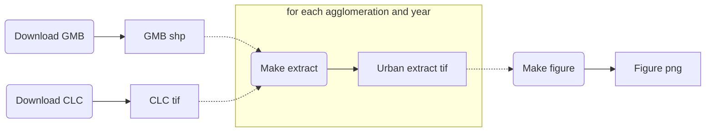

When I started using Jupyter Notebooks, about three years ago, I was astonished of how well that suited my iterative approach to both data analysis and software development. Nevertheless, probably like many others, I also embraced some toxic habits[^i-dont-like-notebooks].

The most troublesome of such practices was perhaps how I managed the data transformations required by my analysis workflow. For instance, after applying many complex transformation to a large pandas DataFrame, I would often conclude a notebook with a cell such as:

```python
# dump the result
df.to_csv('df_after_complex_transformation.csv')
```

so that the following notebook could immediately pick up from through an initial cell as in:

```python
# resume from where last notebook left off
df = pd.read_csv('df_after_complex_transformation.csv')
```

While many of such issues can be settled by choosing helpful file names, good organization, documentation and source control of the code, I felt that there was something missing in my coding toolbox. More precisely, I felt that for data-centric tasks, source control of the code was not enough. Imagine that I found out that I made a mistake in my complex transformation of the DataFrame above and fixed the code accordingly. Since data files like `df_after_complex_transformation.csv` are kept outside source control, when reopening the notebook after some days, perhaps even in another computer, it might be hard to know whether such interim data files are the ones that result from the older code with mistakes or, on the contrary, they are up to date with the fix.

It was not until some months ago, tired of sticking to toxic habits, that I started digging deep into blog posts and GitHub repositories in order to find a solution to this. The best solution came in the form of "A logical, reasonably standardized, but flexible project structure for doing and sharing data science work", namely [Cookiecutter Data Science](http://drivendata.github.io/cookiecutter-data-science/).

As the reader may already know, there exist several tools devoted to manage such kind of computational workflows, and in fact, my initial idea was to write a post in which the appropriateness of such existing tools to geospatial data science was discussed. However, with the description of the example analysis case and the thorough explanation on how to use GNU Make to manage the corresponding computational workflow, the post has already become long enough. So a comparison with similar tools to manage geospatial computational workflows will be left for future posts. Now let us get to an example analysis case.


## An example from geospatial data science: analysis of the spatiotemporal patterns of urbanization

I am currently working on a paper in which I intend to evaluate the spatiotemporal patterns of land cover change associated to urbanization in the main Swiss urban agglomerations. In order to do so, for each of the urban agglomerations I need to generate a time series of raster representations of the land cover. Two datasets are used for this purpose: 

* The [Corine Land Cover (CLC)](https://land.copernicus.eu/pan-european/corine-land-cover) datasets for the years 2000, 2006 and 2012. Each dataset consists of a single `.tif` raster file for the whole European extent that features its land cover, categorized into 44 land cover classes.
* The Swiss [Generalized Municipal Boundaries (GMB)](https://www.bfs.admin.ch/bfs/de/home/dienstleistungen/geostat/geodaten-bundesstatistik/administrative-grenzen/generalisierte-gemeindegrenzen.assetdetail.5247306.html), which consist of a `.shp` vector shape file featuring the administrative boundaries of the municipalities that configure the main Swiss urban agglomerations. The boundaries for a given agglomeration can be extracted by filtering the boundary shapes by their attribute values in the `ANAME` column.

The preprocessing of the data is as follows. For a given agglomeration, at a given year, we first clip the CLC raster of the corresponding year to the extent of the vector boundaries of the agglomeration in question. Since we only interested in the land cover change associated to urbanization, we will then reclassify the pixels of the clipped raster from the 44 land cover classes of CLC to a simplified urban/non-urban representation. The task is illustrated in the animation below.

 

We will then compute two landscape metrics: the [proportion of landscape](http://www.umass.edu/landeco/research/fragstats/documents/Metrics/Area - Density - Edge Metrics/Metrics/C4 - PLAND.htm) occupied by urban land cover, and the [area-weighted mean fractal dimension](http://www.umass.edu/landeco/research/fragstats/documents/Metrics/Shape Metrics/Metrics/P9 - FRAC.htm) of urban patches, which reflects the complexity of their shape.
Finally, we will assemble the computed values for each agglomeration and year in order to generate the following figure, which will help to assess whether the land use change associated to urbanization is leading towards a landscape with more complex shapes.

 


## Enter the computational workflow approach

Let us apply the [Cookiecutter Data Science](http://drivendata.github.io/cookiecutter-data-science/) project structure and its principles to our example case. A repository following such structure, with all the materials needed to reproduce our analysis is available at [GitHub](https://github.com/martibosch/swiss-urbanization-post). Following the [analysis as a Directed Acyclic Graph (DAG)](http://drivendata.github.io/cookiecutter-data-science/#analysis-is-a-dag) approach, a simplified version of the workflow for the task above can be represented as follows:



The nodes with rounded corners represent tasks, whereas the ones with sharp corners represent data states (for instance, interim files). The dashed links towards the highlighted part denote that there should not be a single *make extract* and *urban extract* pair of nodes but a pair for each urban agglomeration and for each year. Since we consider the 3 largest Swiss urban agglomerations (Zurich, Geneva and Basel) for the four years 2000, 2006 and 2012, we will generate a total of 9 urban extracts, which will then be all used in order to produce the final figure.

Note that the computation of the two landscape metrics is done within the *make figure* task. Had it been a computationally-expensive task or had the computed metrics been required for any further step in our analysis, it might have been reasonable to add a dedicated step in the DAG, e.g., a *compute metrics* task between *urban extract* and *make figure*, perhaps dumping the computed metrics to an interim *csv* file.

### Step 1: Download the raw datasets

The [data immutability](http://drivendata.github.io/cookiecutter-data-science/#data-is-immutable) principle basically states that data should never be edited manually, and that anyone should be able to fully reproduce our analysis using only the raw datasets and our code. Accordingly, the *download* steps download the raw datasets to a `data/raw` directory of our repository (whose files will be ignored by git). 
While some datasets can be downloaded by anyone from open-data services like [Zenodo](https://zenodo.org/), other datasets like CLC require a registration. In the latter case, I store the raw datasets in a personal S3 bucket, and then create a Python script that downloads the files from the bucket using the [boto3](https://github.com/boto/boto3) library. 
Overall, such approach to the *download* steps ensure that the raw datasets will be the same regardless on whether I am running the analysis in my laptop or my office's desktop computer.


### Step 2: Make the urban extracts

The *make extract* step perform the preprocessing task described above, taking datasets from `data/raw` as inputs and outputting the urban extracts raster files to `data/processed`. 


### Step 3: Make the figure

Finally, the *make figure* will first use the [PyLandStats library](https://github.com/martibosch/pylandstats) in order to compute the landscape metrics for the urban extract located at `data/processed`, plot their evolution for each agglomeration, and then save the figure to `reports/figures`. 


## Automating the workflow with GNU Make

As noted above, we intend to automate the way we move the steps of our workflow, so that we do not need to ask whether we have applied or not certain data transformation nor whether such transformation has been performed according to the latest version of our code. Ideally, we want manage the execution of such steps explicitly (without hidden state) and in an automated manner, avoiding tricks such as caching an interim `df_after_complex_transformation.csv` file
To that end, we will use GNU Make.  

Many people (like myself) always thought of Make as a tool to compile executables from source code, especially in C. Their syntax is quite simple. We create a file named `Makefile` at the root of our repository, and write a set of rules there.

```make
target: prerequisites
	commands
```

The way in which we can chain rules can be used to mimic our analysis DAG. A very straightforward way to do so would be with a `Makefile` such as:

```make
download_gmb:
	python src/data/download_gmb.py

download_clc:
	python src/data/download_clc.py
    
extracts: download_gmb download_clc
	python src/data/make_urban_extracts.py
    
figure: extracts
	python src/visualization/make_figure.py
```

Then, from the repository's root, we can run `make figure`, and Make will detect that the `figure` target depends on the `extracts` target, and that the latter depends on both `download_gmb` and `download_clc`, and therefore Make will automatically determine the right order in which the tasks must be executed in order to produce our figure. This is the idea beyond the concept of an "automated management of the computational workflow". 
Nevertheless, as elegant as the above `Makefile` might look, and despite the fact that it would succeed in producing our figure, we would be making a poor use of the features that Make has to offer. 


### Detecting completed targets

Imagine that our `src/visualization/make_figure.py` has a mistake which is (for example) labeling our figure's axes incorrectly. If we fix such mistake, and run `make figure` again, Make will blindly execute again all of the necessary steps, including the download of 551.9 MB of unchanged raw datasets, and the generation of the exact same 9 urban extracts. Since our datasets could be of gigabytes, and our steps could be computationally expensive algorithms, we want our management of the computational workflow to automatically detect whether a task must be re-executed or not.

This idea is in fact central to Make. In order to exploit it, we just need that targets match file paths. For instance, we could refactor our download scripts to take the destination file path as command-line argument and download the files to such location. Under these circumstances, we could use such destination file path as target of the two download rules and prerequisite of the `extracts` rule, as in:

```make
data/raw/gmb/gd-b-00.03-875-gg18.zip:
	python src/data/download_gmb.py data/raw/gmb/gd-b-00.03-875-gg18.zip
```

and we could further DRY our rule by storing such path in a variable of our `Makefile` as in:

```make
GMB_ZIP_FILEPATH = data/raw/gmb/gd-b-00.03-875-gg18.zip

$(GMB_ZIP_FILEPATH):
	python src/data/download_gmb.py $(GMB_ZIP_FILEPATH)
```

Note, however, that if we now want download the GMB dataset, the elegant command `make download_gmb` becomes the less appealing `make data/raw/gmb/gd-b-00.03-875-gg18.zip`. We might overcome this drawback by writing an additional dummy rule such as:

```make
. . .

download_gmb: $(GMB_ZIP_FILEPATH)
```

so that now, whenever we call `make download_gmb`, Make will automatically detect whether the file path `data/raw/gmb/gd-b-00.03-875-gg18.zip` exists and accordingly decide whether the file should be downloaded (that is, running `src/data/download_gmb.py`) or not. 

#### Two comments on Phony targets

In Make, targets which do not correspond to any file path, such as `download_gmb`, are called [Phony targets](https://www.gnu.org/software/make/manual/html_node/Phony-Targets.html). A typical example would be a rule which does not produce any output, for instance, [a rule to delete compiled Python files](https://github.com/martibosch/swiss-urbanization-post/blob/master/Makefile#L101). Two remarks are especially relevant in this situation:

* When a rule depends on a Phony target, Make will always execute the rule associated with the Phony target. This is in sharp contraposition to file path targets, which Make will ignore if the corresponding file is up to date. That means that dummy rules such as the proposed `download_gmb` cannot be used as rule prerequisites. That is, using

    ```make
    # again, let us ignore `download_clc` for now
    extracts: download_gmb download_clc
    	python src/data/make_extracts.py
    ```
    
    instead of `extracts: $(GMB_ZIP_FILEPATH) download_clc`, implies that Make will no longer be able to detect whether downloading the GMB dataset is necessary or not. The bottom line is: you might add dummy rules with Phony targets to have a more elegant command-line interface (CLI) with your Makefile, but do not use such dummy rules as prerequisites of other rules unless you really want them to be executed regardless on the state of your workflow.
    
* Was there a file matching the path `download_gmb`, Make would assume that the target refers to such file. In order to avoid such conflicts, Phony targets can be explicitly declared as prerequisites of a rule with the [special target](https://www.gnu.org/software/make/manual/html_node/Special-Targets.html#Special-Targets) `.PHONY` as in:

    ```make
    .PHONY: download_gmb
    
    . . .
    
    download_gmb: $(GMB_ZIP_FILEPATH)
    ```

#### File modification times and order-only prerequisites

Some rules might require creating directories in our tree. For instance, the `data/raw/gmb` directory in which `gd-b-00.03-875-gg18.zip` is to be downloaded might not exist. There are many ways of dealing with such situation, for instance, within the Python script. Nonetheless, *handling this explicitly within the Makefile might be preferable, in order to avoid potential sources of hidden state*. We might thus add an additional rule that creates the `data/raw/gmb` directory only when such path does not exist (otherwise it would throw a `File exists` error). We can do so as follows:

```make
GMB_DIR = data/raw/gmb
# Since `$(GMB_DIR)` is constant, we use `:=` so that Make expands the path 
# only once instead of doing so every time `GMB_ZIP_FILEPATH` is used. 
# See https://www.gnu.org/software/make/manual/make.html#Flavors
GMB_ZIP_FILEPATH := $(GMB_DIR)/gd-b-00.03-875-gg18.zip

$(GMB_DIR):
	mkdir $(GMB_DIR)

$(GMB_ZIP_FILEPATH): $(GMB_DIR)
	python src/data/download_gmb.py $(GMB_ZIP_FILEPATH)
```

Let us go further. Since our tasks will require the use of the GMB shapefiles rather than of the GMB zip, we might use the `unzip` command in order to extract them. We can even remove the GMB zip once the shapefiles are extracted. This could all be done as in:

```make
GMB_DIR = data/raw/gmb
GMB_ZIP_FILEPATH := $(GMB_DIR)/gd-b-00.03-875-gg18.zip
GMB_SHP_FILEPATH := $(GMB_DIR)/g1a18.shp

$(GMB_DIR):
	mkdir $(GMB_DIR)

$(GMB_SHP_FILEPATH): $(GMB_DIR)
	python src/data/download_gmb.py $(GMB_ZIP_FILEPATH)
	unzip $(GMB_ZIP_FILEPATH) -d $(GMB_DIR)
	rm $(GMB_ZIP_FILEPATH)
```

A peculiar issue can arise with the above Makefile. When using `unzip` command, the modification times of the extracted files (such as `$(GMB_SHP_FILEPATH)`) will be those of their creation, whereas for `$(GMB_DIR)`, the modification time will correspond to the moment in which the files were extracted under such directory. Accordingly, in the eyes of Make, the target `$(GMB_SHP_FILEPATH)` will appear older than its prerequisite `$(GMB_DIR)`, and therefore the rule will always be executed. 

There are two ways to work around such issue. On the one hand, we could use the `touch` command, which will set the modification date of `$(GMB_SHP_FILEPATH)$` to the current date[^unzip-touch], as in:

```make
. . .

$(GMB_SHP_FILEPATH): $(GMB_DIR)
	python src/data/download_gmb.py $(GMB_ZIP_FILEPATH)
	unzip $(GMB_ZIP_FILEPATH) -d $(GMB_DIR)
	touch $(GMB_SHP_FILEPATH)
	rm $(GMB_ZIP_FILEPATH)
```

Alternatively, we could also tell Make that `$(GMB_DIR)` is an [order-only prerequisites](https://www.gnu.org/software/make/manual/html_node/Prerequisite-Types.html), which ignore the modification dates and are executed only if the files or directories in question do not exist. Order-only prerequisites must be placed to the right of a pipe symbol `|`, which in our example would be:

```make
. . .

# a target might have both normal and order-only prerequisites, e.g.,
# $(GMB_SHP_FILEPATH): some-normal-prerequisite-target | $(GMB_DIR)
$(GMB_SHP_FILEPATH): | $(GMB_DIR)
	python src/data/download_gmb.py $(GMB_ZIP_FILEPATH)
	unzip -j $(GMB_ZIP_FILEPATH) -d $(GMB_DIR)
	rm $(GMB_ZIP_FILEPATH)
```

Again, note that we could use [Python's zipfile library](https://docs.python.org/3/library/zipfile.html) and deal with the extraction of the shapefiles within the script `src/data/download_gmb.py`, nevertheless this will further complicate the non-trivial task of ensuring that Make manages our computational workflow correctly.


### Pattern rules and abstracting our workflow from the data

Let us now consider the task of downloading the CLC datasets. Like GMB, CLC datasets come as a zip file, from which we intend to extract a geotiff file (instead of shapefiles in GMB). The major difference with respect to GMB is that we now need to download three datasets, namely one for each year. Accordingly, `src/data/download_clc.py` needs to know which CLC dataset to download in every case. Since CLC names its datasets as in `g100_clc00_V18_5`, `g100_clc06_V18_5` and `g100_clc12_V18_5` (note the year codes `00`, `06` and `12` right after the `clc` characters), let `src/data/download_clc.py` take such basename as first argument (to know which dataset to download), and as usual, the destination file path as second argument. Consider the following snippet:

```make
# Note that we should first handle the creation of the `data/raw/clc` 
# directory like explained above for `$(GMB_DIR)`
CLC_DIR = data/raw/clc

$(CLC_DIR):
	mkdir $(CLC_DIR)
    
# and now we can start with the CLC dataset for the year code 00 (2000)
CLC_00_BASENAME = g100_clc00_V18_5
CLC_00_ZIP_FILEPATH := data/raw/clc/$(CLC_00_BASENAME).zip

$(CLC_00_ZIP_FILEPATH): | $(CLC_DIR)
	python src/data/download_clc.py $(CLC_00_BASENAME) \
	    $(CLC_00_ZIP_FILEPATH)
```

Since writing the foregoing rule for each dataset year would clearly be over-repetitive and become hard to maintain, Make features [pattern rules](https://www.gnu.org/software/make/manual/html_node/Pattern-Rules.html), which are like ordinary rules but use a pattern-matching mechanism on file paths. We can tell make that the commands to any zip target within `$(CLC_DIR)` are as follows:

```make
. . .

$(CLC_DIR)/%.zip: | $(CLC_DIR)
	python src/data/download_clc.py $(notdir $@) $@
```

where the `%` is used to compose the target pattern. We could also tell Make, for example, to only match zip files starting by `g100_clc` as in `$(CLC_DIR)/g100_clc%.zip`. On the other hand, the full expanded path of the target (in the above example, that is `data/raw/clc/g100_clc00_V18_5.zip`) will be stored under the `$@` [automatic variable](https://www.gnu.org/software/make/manual/html_node/Automatic-Variables.html#Automatic-Variables), which we can use within the rule commands. Given how we have assumed `src/data/download_clc.py` to work, we can use [Make's functions for file names](https://www.gnu.org/software/make/manual/html_node/File-Name-Functions.html) `notdir` to extract the file name from the path (that is, `g100_clc00_V18_5.zip` from `data/raw/clc/g100_clc00_V18_5.zip`), and then `basename` to trim out the `.zip` extension.

In order to define an abstract computational workflow that is independent of the individual files[^abstract-workflow], we can define the datasets to be processed in a separate variable, as in the snippet below:

```make
. . .

CLC_BASENAMES = g100_clc00_V18_5 g100_clc06_V18_5 g100_clc12_V18_5

CLC_ZIP_FILEPATHS := $(addsuffix .zip, \
    $(addprefix $(CLC_DIR)/, $(CLC_BASENAMES)))

$(CLC_DIR)/%.zip: | $(CLC_DIR)
	python src/data/download_clc.py $(notdir $@) $@

download_clc: $(CLC_ZIP_FILEPATHS)
```

Were we to consider an additional dataset in our analysis, only by adding it to `CLC_BASENAMES`, Make would be able to manage and execute our computational workflow accordingly. By applying the file name functions `addprefix` and `addsuffix` as shown above, `CLC_ZIP_FILEPATHS` will be a list of file paths (such as `data/raw/clc/g100_clc00_V18_5.zip`) for each base name in `CLC_BASENAMES`. Whenever we execute the Phony target `download_clc`, for each file path of `CLC_ZIP_FILEPATHS` [Make will detect that it matches the `$(CLC_DIR)/%.zip` pattern](https://www.gnu.org/software/make/manual/html_node/Pattern-Match.html#Pattern-Match) and proceed accordingly. Furthermore, since the next steps within the computational workflow do not require the zip files but the shapefiles and geotiff files that contain, we could [chain the pattern rules](https://www.gnu.org/software/make/manual/html_node/Chained-Rules.html) as in:

```make
. . .

CLC_BASENAMES = g100_clc00_V18_5 g100_clc06_V18_5 g100_clc12_V18_5

CLC_TIF_FILEPATHS := $(addsuffix .tif, \
    $(addprefix $(CLC_DIR)/, $(CLC_TIF_FILENAMES)))

$(CLC_DIR)/%.zip: | $(CLC_DIR)
	python src/data/download_clc.py $(notdir $@) $@

$(CLC_DIR)/%.tif: $(CLC_DIR)/%.zip
	unzip $< '$(basename $(notdir $@)).*' -d $(CLC_DIR)
	touch $@

download_clc: $(CLC_TIF_FILEPATHS)
```

so that when executing `make clc`, Make first matches the `$(CLC_DIR)/%.tif`, and determines that such geotiff target requires its corresponding zip, which will in turn be matched by the above rule with the `$(CLC_DIR)/%.zip` target. Note that the `$<` right after `unzip` is another automatic variable of Make, which corresponds to the first prerequisite of the rule in question (in this case, the path to zip file). Under these circumstances, if there is no further reference to `$(CLC_DIR)/%.zip`, [Make will consider the zip files as intermediate](https://www.gnu.org/software/make/manual/html_node/Chained-Rules.html) and will therefore remove them once the `$(CLC_DIR)/%.tif` targets have been produced. The same will not happen after extracting `$(GMB_SHP_FILEPATH)` from `$(GMB_ZIP_FILEPATH)` since the path to the zip file is stored in the latter variable and in such case Make does not remove it. We could achieve the same behavior by defining a pattern rule of the same form for GMB, even when we know that there is only a single file involved.


#### Metaprogramming: generating rules dynamically

Now comes the most convoluted part of our Makefile. In order to generate the urban extracts for each year and agglomeration, the script `src/data/make_urban_extract.py` needs the path to the GMB shapefile, a reference to the corresponding agglomeration (for instance, a slug as in `basel`) so that its boundaries can be extracted from the GMB shapefile (as detailed above, by filtering the values of the `ANAME` attribute column of the shapes), the CLC geotiff of the corresponding year, and a file path to dump the generated urban extract. We could make use of what we have seen so far and write a rule such as:

```make
. . .

URBAN_EXTRACTS_DIR = data/processed/urban_extracts

$(URBAN_EXTRACTS_DIR):
	mkdir $(URBAN_EXTRACTS_DIR)
$(URBAN_EXTRACTS_DIR)/basel-%.tif: $(CLC_DIR)/%.tif $(GMB_SHP_FILEPATH) \
    | $(URBAN_EXTRACTS_DIR)
	$(PYTHON_INTERPRETER) src/data/make_urban_extract.py \
	    $(GMB_SHP_FILEPATH) basel $< $@
```

and so on for each agglomeration, but again, this would be hard to maintain as we include additional urban agglomerations. We will instead adopt a metaprogramming approach which consists in defining a variable with the list of the agglomeration slugs, and then dynamically generate a rule for each agglomeration as follows:

```make
. . .

AGGLOMERATION_SLUGS = basel geneve zurich

define MAKE_URBAN_EXTRACT
$(URBAN_EXTRACTS_DIR)/$(AGGLOMERATION_SLUG)-%.tif: \
    $(CLC_DIR)/%.tif $(GMB_SHP_FILEPATH)| $(URBAN_EXTRACTS_DIR)
	python src/data/make_urban_extract.py $(GMB_SHP_FILEPATH) \
	    $(AGGLOMERATION_SLUG) $$< $$@
endef

$(foreach AGGLOMERATION_SLUG, $(AGGLOMERATION_SLUGS), \
    $(eval $(MAKE_URBAN_EXTRACT)))
```

The `MAKE_URBAN_EXTRACT` works as a template which GNU Make's `eval` function will use to dynamically generate rules. Note automatic variables within the template have been escaped through a preceding additional `$`. This is because the templates that we pass as argument to `eval` (in this case, `MAKE_URBAN_EXTRACT`) are expanded before we call them, so the variables that must be expanded during the execution of the rule (for instance, any automatic variable) should be escaped[^metaprogramming]. The use of [Make's `foreach` function](https://www.gnu.org/software/make/manual/html_node/Foreach-Function.html) in order to dynamically generate a rule for each agglomeration is quite self-explanatory.

Subsequently, we will then use a nested loop to generate the full list of file paths of the form `data/processed/urban_extracts/{agglomeration}-{clc_basename}.tif` for each agglomeration and each CLC dataset, and create a Phony target to generate all the urban extracts:

```make
. . .

URBAN_EXTRACTS_TIF_FILEPATHS := $(addprefix $(URBAN_EXTRACTS_DIR)/, \
    $(foreach CLC_BASENAME, $(CLC_BASENAMES), \
        $(foreach AGGLOMERATION_SLUG, $(AGGLOMERATION_SLUGS), \
            $(AGGLOMERATION_SLUG)-$(CLC_BASENAME).tif)))
            
urban_extracts: $(URBAN_EXTRACTS_TIF_FILEPATHS)
```

Given how pattern rules work, Make will be able to match each of the file paths for urban extract to the rule that we have dynamically created for the corresponding agglomeration.


### Detecting edited source files

We will now proceed to the final part of the workflow, namely generating the figure and introduce another nice feature of Make while we are at it. There are many ways in which we can generate the figure from the urban extracts. We will use a script `src/visualization/make_figure.py` which will take as first argument the directory where the urban extracts are located, the output file path to store the figure as second argument, and three options allowing a list of values for the desired metrics, CLC basenames (each corresponding to a particular year) and the agglomeration slugs. The Python script will then deal with the association of each file path of the urban extracts to its respective agglomeration slug and CLC year.

```make
. . .

FIGURE_FILEPATH = reports/figures/swiss-urbanization.png
METRICS = proportion_of_landscape fractal_dimension_am

$(FIGURE_FILEPATH): $(URBAN_EXTRACTS_FILEPATHS)
	python src/visualization/make_figure.py $(URBAN_EXTRACTS_DIR) \
	    $(FIGURE_FILEPATH) --metrics $(METRICS) \
	    --clc-basenames $(CLC_BASENAMES) \
	    --agglomeration-slugs $(AGGLOMERATION_SLUGS)
    
figure: $(FIGURE_FILEPATH)
```

There is nothing tricky in the above snippet. Just note that we are using `$(URBAN_EXTRACTS_FILEPATHS)` as prerequisite and not `urban_extracts`, since as explained above, Phony targets are always executed even if the required files are up to date. Unless we changed the code, at this point running `make figure` will, from any starting conditions, proceed to the end of the workflow in the most efficient manner. 

Let us now introduce the last feature of Make covered by this example case. Imagine that we have successfully generated our figure but we have changed the code of `src/visualization/make_figure.py` in order to (for instance) change the axis labels. We could remove the former figure, and execute `make figure` again. Nevertheless, this would still require manual interaction. Furthermore, let us assume that in the same way that we might need to update `src/visualization/make_figure.py`, other reasons require us to update an earlier of our workflow such as `src/data/make_urban_extract.py`. Under such circumstances, we would not need to manually remove a single figure but perhaps all the urban extracts. In order to let Make deal with such circumstances in an automated manner, we can set the file path to the script as a prerequisite of its corresponding rule. For instance, the latter snippet could be refactored to:

```make
...
MAKE_FIGURE_PY = src/visualization/make_figure.py

$(FIGURE_FILEPATH): $(URBAN_EXTRACTS_FILEPATHS) $(MAKE_FIGURE_PY)
	python $(MAKE_FIGURE_PY) $(URBAN_EXTRACTS_DIR) $(FIGURE_FILEPATH) \
	    --metrics $(METRICS) \
	    --clc-basenames $(CLC_BASENAMES) \
	    --agglomeration-slugs $(AGGLOMERATION_SLUGS)
```

Now whenever we edit `src/visualization/make_figure.py`, its modification time will be more recent than that of its respective target (that is, the figure file), and therefore if we execute `make figure`, Make will detect that the rule needs to be executed again. The above approach frees us from the duty of manually managing such situations, and might become crucial in other analysis cases, the amount of interim and processed data files might be in the range of hundreds, thousands or basically any number.


## Concluding remarks

We have seen a thorough introduction to the use of GNU Make to manage computational workflows in geospatial data science. Here are some remarks from the perspective of someone coming from a Python background. 

The main advantage of Make is its flexibility, which allows it to precisely manage any kind of computational workflow, from the compilation of source files to the example above. Nonetheless, this flexibility comes at the price of a syntax which is obviously less pleasant than Python's, especially as we try to get the most out of Make and as a consequence Makefiles become inevitably abstract. 


### Avoid hidden state: let Make (not Python) carry the burden of managing your workflow

While many (like myself) would feel more comfortable tackling the organization of a computational workflow in Python, it is important to delegate such burden to the Makefile. We have accordingly implemented our scripts so that they take the destination file path as a command-line argument. While the management of the input and output paths could have been handled within the Python scripts, under such circumstances Makefiles would have to make assumptions about how the script works. Avoiding this is in accordance to the idea of encapsulation of object-oriented programming as well as to a core Pythonic principle, namely "explicit is better than implicit". The only distinction is that this time we must apply the foregoing principle to Make rather than to Python. **An explicit control of the inputs an output files within Makefiles is crucial towards avoiding potential sources of hidden state**.

In order to make the most out of Make, it is preferable that the Python scripts focus on the data processing tasks and are as agnostic of the project structure as possible. Overall, a sharp knowledge of the involved Python libraries combined with the flexibility of GNU Make should allow an efficient management of the computational workflow of most analysis cases.


### Python modules and detecting edited source files

Another remark can be made with respect to how we have organized our scripts. We often organize Python code in a way that a `.py` file might perform multiple tasks, especially when we are using the [Click](https://palletsprojects.com/p/click/) library to create CLI, which [allows a command to have a group of subcommands attached](https://click.palletsprojects.com/en/7.x/commands/). 

In our example case, we could have implemented both `src/data/download_gmb.py` and `src/data/download_gmb.py` within a single Python module `src/data/download_data.py`. Nevertheless, if we set such single script as prerequisites of GMB and CLC respective rules (as we have shown above for `src/visualization/make_figure.py`), Make will always re-execute both rules when we edit its source, even if the amendments only concern one of the rules.

It is thus recommended that each `.py` file serves one and only one Make rule, even if that might sometimes feel strange for Python developers.


### Alternatives to Make

There are indeed alternatives to GNU Make which might be better suited for certain analysis[^awesome-pipelines]. While many of them make reference to the fields of bioinformatics and machine learning, the same does not hold for geospatial data science. Nevertheless, most of the core principles apply similarly throughout all data-centric analysis cases.

My intention is to implement the management workflow of this post within [Snakemake](https://snakemake.readthedocs.io/en/stable/), which seems very aligned with Make while providing a more appealing syntax. On the other hand, before discovering the [Cookiecutter Data Science](http://drivendata.github.io/cookiecutter-data-science/) project structure, I used [dvc](https://github.com/iterative/dvc) in a geospatial analysis case. While it has the nice asset of employing checksums on the data files to ensure their consistency within the workflow (and different computers), and features a nice integration with git and S3 storage, [its CLI does not allow for a forthwith integration with the Cookiecutter Data Science project structure](https://github.com/iterative/dvc/issues/611). Nonetheless, there seems to be [some work in progress to overcome such drawback](https://github.com/drivendata/cookiecutter-data-science/issues/158).
On the other hand, I would also like to try the innovative approach of [Renku](https://renku.readthedocs.io) (currently under early development stages), which appears similar to [dvc](https://github.com/iterative/dvc) but more general, that is, less centered on machine learning workflows. Either way, I will try to come back with another post on this topic soon. 

Regarding the research question of the example case, can we say that the landscapes of the main three Swiss agglomerations are becoming increasingly complex? Well, it is hard to say with this simplified example, but a more thorough manuscript is under preparation.

## Notes

[^i-dont-like-notebooks]: See [the talk by Joel Grus at JupyterCon 2018](https://www.youtube.com/watch?v=7jiPeIFXb6U) about Jupyter Notebooks and toxic habits

[^unzip-touch]: The workaround of combining `touch` and `unzip` is borrowed from [Mike Bostock's post on using Make for reproducible workflows](https://bost.ocks.org/mike/make/#syntax)

[^abstract-workflow]: See also [Michael Barton's post on reproducible workflows with GNU Make](https://web.archive.org/web/20150206054212/http://www.bioinformaticszen.com/post/decomplected-workflows-makefiles/#abstraction-of-analysis-steps)

[^metaprogramming]: For more details on how the `eval` function works, as well as more Make metaprogramming tricks see [this thorough post by Paul D. Smith](http://make.mad-scientist.net/the-eval-function/)

[^awesome-pipelines]: See the [awesome-pipeline](https://github.com/pditommaso/awesome-pipeline) repository for a thorough list of tools to manage computational workflows.
