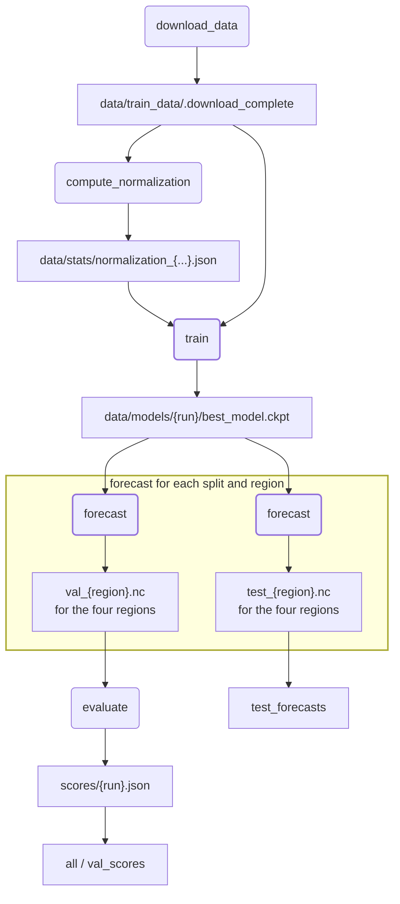
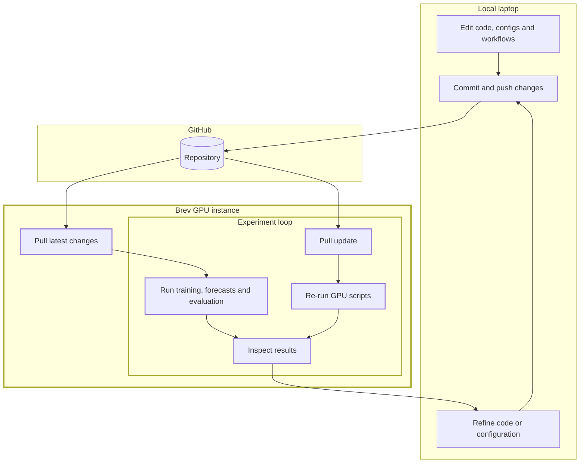
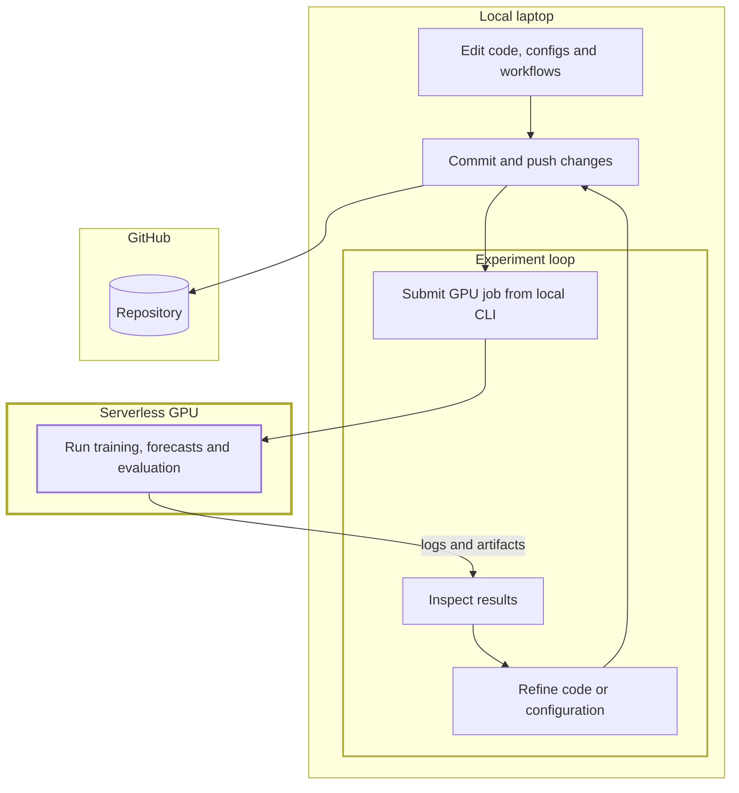

I finally managed to "win" the [Climate informatics 26 Hackathon](https://tobifinn.github.io/ci_hackathon_26) on using deep learning to predict cloud cover. Too bad this happened only: 

- one week after the final submission deadline,
- after being able to see [the actual winning solution](https://github.com/radiradev/1st-place-solution-CI2026),
- spending half of my Claude Pro weekly limits, and
- spending some extra 25$ from my pocket on [NVIDIA Brev](https://developer.nvidia.com/brev).

But let us focus on the positive side: what did I learn? I would say a lot. As someone relatively new to deep learning but relatively experienced in scientific Python (or at least I would like to think so), I was very curious to see how the "good practices" that I have learned over the years for computational pipelines that I run locally apply to deep learning pipelines that run on GPU servers. Here are some thoughts.

## The CI2026 starter kit

All the participants started from [a base repository set up by Tobias Finn](https://github.com/tobifinn/CI2026-StarterKit) (a big shout-out for the organization) with the following structure:

```text
CI2026-StarterKit/
+-- configs/                  # Hydra settings
|   +-- data/                 # dataset paths and splits
|   +-- experiments/          # baseline experiment presets
|   +-- model/                # architecture hyperparameters
|   +-- suite/                # validation/test forecast suites
|   +-- test_data/            # test-set paths
|   +-- train.yaml            # default training config
|   +-- forecast.yaml         # default forecast config
|   +-- submit.yaml           # default submission config
+-- data/                     # local runtime data, not committed
|   +-- train_data/           # downloaded inputs and targets
|   +-- models/               # checkpoints and logs
|   +-- forecasts/            # generated netCDF predictions
+-- notebooks/                # exploration and analysis
+-- scripts/                  # Hydra entry points
|   +-- train.py              # train a model
|   +-- forecast.py           # generate forecasts
|   +-- evaluate.py           # score validation forecasts
|   +-- submit.py             # forecast and submit predictions
+-- starter_kit/              # installable Python package
    +-- data.py               # PyTorch datasets
    +-- layers.py             # input normalisation
    +-- model.py              # shared training interface
    +-- baselines/            # reference model implementations
        +-- mlp.py
        +-- parametric.py
        +-- sundquist.py
```

This is indeed a structure that I have seen quite often in GitHub but I had never actually used myself, essentially because it is designed to run on a GPU. Instead, I have sticked to [my personal flavour](https://github.com/martibosch/cookiecutter-data-snake) of the [cookiecutter-data-science](https://cookiecutter-data-science.drivendata.org) template and my GPU requirements have been fullfilled *serverlessly* by writing modal apps, e.g., to [run AIFS forecasts](https://github.com/martibosch/aifs-modal), or to [run training/inference steps in computer vision](https://github.com/martibosch/deepforest-modal-app). But we'll get to that later — for this workshop, we had 100$ of [Brev](https://brev.nvidia.com) credits (graciously offered by Nvidia) to run on NVIDIA L4 GPUs throughout the hackathon, so we did not have to worry about GPU cost.

## Snakemake, my dearest friend

After launching the provided Brev environment, accessing it through JupyterLab and setting up conda environment, the first step of the computational pipeline was to download (and unzip) [the input dataset from HuggingFace](https://huggingface.co/datasets/tobifinn/CI2026Hackathon). Then, we copied and pasted a few of the commands to run [training](https://github.com/tobifinn/CI2026-StarterKit#training), [inference](https://github.com/tobifinn/CI2026-StarterKit#forecasting) and [evaluation](https://github.com/tobifinn/CI2026-StarterKit#evaluation) with the provided baseline multi-layered perceptron (MLP) model:

```bash
# for the baseline MLP, per Hydra defaults
python scripts/train.py n_epochs=50 learning_rate=5e-4 device=cuda
python scripts/forecast.py device=cuda
python scripts/evaluate.py \
    --prediction_dir data/forecasts/baseline_mlp \
    --to_json \
    --output_path scores/baseline_mlp.json
```

as well as with the physical reference baseline following Sundqvist et al. (1989)[^sundqvist]

```bash
python scripts/train.py +experiments=baseline_sundquist device=cuda
python scripts/forecast.py +experiments=baseline_sundquist device=cuda
python scripts/evaluate.py --prediction_dir data/forecasts/baseline_sundquist
python scripts/evaluate.py \
    --prediction_dir data/forecasts/baseline_sundquist \
    --to_json \
    --output_path scores/baseline_sundquist.json
```

However, it only took me copy-pasting these commands to mess up and overwrite the MLP scores with its Sundqvist by forgetting to update `--output_path`. At that point, it immediately occured to me that I usually lean on Snakemake to avoid these mistakes, so why shouldn't I do the same here? Enter Snakemake.

Since Hydra already takes care of managing paths for the train and forecast parts, the main gap was the `scripts/evaluate.py` step, where `--output_path` had to be specified manually. Adding a thin Snakemake wrapper around all three steps meant that paths flow automatically from the `{run}` wildcard through the whole chain via a directed acyclic graph (DAG): the right commands run in the right order and already-completed steps are skipped on re-runs. We also added the data download and unzip steps so that the full pipeline — from raw dataset to evaluation scores — could be expressed as a single snakemake call. Furthermore, region expansion, which would otherwise require looping over the four ERA5 and AIMIP domains by hand, became a one-liner with `expand()`. Convenience targets like `all` and `test_forecasts` replaced sequences like:

```bash
for region in era5_region1 era5_region2 aimip_region1 aimip_region2; do
    python scripts/forecast.py +experiments=baseline_mlp \
        +test_data=val_${region} device=cuda
done
python scripts/evaluate.py \
    --prediction_dir data/forecasts/baseline_mlp \
	--to_json \
	--output_path scores/baseline_mlp.json 
```

with a single call:

```bash
snakemake --config runs=baseline_mlp -j1 --resources gpu=1
```

The checkpoint and forecast paths (e.g., `data/models/{run}/best_model.ckpt`) are declared in both Snakemake (for DAG construction) and in the Hydra configs (for runtime resolution). This is unavoidable: Snakemake must know file paths statically to determine what to run and what to skip. Nonetheless, in practice the overlap is small and the convention is simple enough that keeping both synchronized is a one-line change.

The value of adding a Snakefile did not stop there though: we realized that reference values for normalization [were pre-computed from the training data and hardcoded to `mlp.py`](https://github.com/tobifinn/CI2026-StarterKit/blob/main/starter_kit/baselines/mlp.py#L31-L43), so in order to add further [meteorological calculations](https://unidata.github.io/MetPy/latest/api/generated/metpy.calc.html) as derived input features (computed on-the-fly in the forward pass), we needed to add the computation of reference values to the pipeline with a new `compute_normalization` rule. The overall pipeline at this point looked as follows:



## Interlude: our submission

I am not going to develop much on our submitted network because we did not win. My colleague was right to suggest using a U-Net[^unet-claude], to which we added sphere-aware padding (circular along the longitude axis, replicate along latitude) and added relative humidity as a derived input feature computed on-the-fly in the forward pass alongside the raw pressure-level fields and two static auxiliary fields (land-sea mask and orography). The best results network were obtained with a wide configuration (96 base channels, 3 downsampling stages). 

From my experience in computer vision, I actually thought of including augmentation-like transforms to our training loop, but discarded it since I considered that these would disregard the semantics of the land-sea mask and orography. However, in retrospective, the most likely reason we fell short was actually including those static geographic fields. By seeing the land-sea mask and orography during training, the network learned to associate cloud patterns with specific landscape features of the training region rather than the underlying atmospheric dynamics, and those associations do not transfer to a held-out region with different geography.

The winning solution description actually pointed at this: a geography-agnostic design that drops all static inputs and relies solely on pressure-level fields generalizes across regions by construction.


## Comparing experiments

The starter kit provided logged the training loss at each epoch to a CSV file of the form `data/models/<exp_name>/train_log.csv`. In order to better compare experiments, we set up integration with [Weights & Biases](https://wandb.ai). We could have also used [MLflow](https://github.com/mlflow/mlflow) but I could not find a free hosted solution which allowed multiple collaborators — something included within the [free academic plan of Weights & Biases](https://wandb.ai/site/pricing).

In any case, besides our submitted `unet_brute_xlarge` configuration, I added two additional experiments *a posteriori*. The first is `geounet_wide_rh_hilr`, a geography-agnostic UNet variant based ont the winning solution, to which I added on-the-fly relative humidity to the forward pass and set a high learning rate (0.001). The second is a (vibe-coded) SegFormer-B2 variant `segformer_b2_rh`, i.e., a transformer-based architecture that replaces the CNN backbone with a Mix Transformer encoder and a lightweight MLP decoder. The following validation loss curves from Weights & Biases summarize the comparison:


The `segformer_b2_rh` setup performed very poorly: its pre-training on natural images (ImageNet) and classification-oriented decoder were likely not the best choice. I may further add a U-Net with a Swin Transformer encoder, since its shifted-window attention is probably better to capture local spatial structure.

I also vibe-coded [a notebook to visualize the outputs of each model](https://github.com/martibosch/CI2026-StarterKit/blob/main/notebooks/visualize_inputs_and_predictions.ipynb):


and [another notebook to inspect the distribution of each physical variable accross pressure levels](https://github.com/martibosch/CI2026-StarterKit/blob/main/notebooks/normalization_analysis.ipynb) and potentially identify improvements to the z-score normalization — although some preliminary experiments suggest that these may make very little effect.

## On the overall development workflow: another case for serverless computer?

The setup allowed editing code directly in Brev using JupyterLab. However, as a long time emacs user, that was not my preferred approach[^emacs-jupyter]. Additionally, if I am not mistaken, only one user could access JupyterLab at a time, so we ended up adopting this workflow:



The positive part of this set up is that all changes need to go through git, which can enforce good practices by means of pre-commit hooks and potentially continuous integration (CI). The bad part is that the GPU was idle most of the time. In fact, after setting up the Brev instance on the first day of the hackathon, my colleague and I went for lunch and realized that about $2 of credits were gone becuse we simply did not "Stop" the Brev deployment.

Although the training of the heaviest models could take about 2 hours to complete on the L40 GPU, iterative development of Python and yaml files largely dominated our overall time to solution. Using a GPU server for that not only is overkill but also inconveniennt as it hampers the good practices provided by LSP features in integrated development environment (IDEs) — especially for Emacs users such as myself. I thus believe that this is another great use case for a *serverless* setup:



I may explore a [Modal](https://modal.com) version of this set up soon to verify whether it is another good case for serverless computing.

## Notes

[^sundqvist]: See Sundqvist, H., Berge, E., & Kristjánsson, J. E. (1989). Condensation and cloud parameterization studies with a mesoscale numerical weather prediction model. Monthly Weather Review, 117(8), 1641-1657.
[^unet-claude]: I suppose Claude suggested using a U-Net because that is what almost every submission did.
[^emacs-jupyter]: I use [snakemacs](https://github.com/martibosch/snakemacs), a fully pixi-based emacs setup up that provides environment-aware Language Server Protocol (LSP) features and allows interactive execution of Jupyter notebooks as Python scripts using [code-cells](https://github.com/astoff/code-cells.el), [emacs-jupyter](https://github.com/emacs-jupyter/jupyter) and [pixi-kernel](https://github.com/renan-r-santos/pixi-kernel). See also my post ["Jupyter in the Emacs universe"](https://martibosch.github.io/jupyter-emacs-universe) on emacs-Jupyter integrations.
